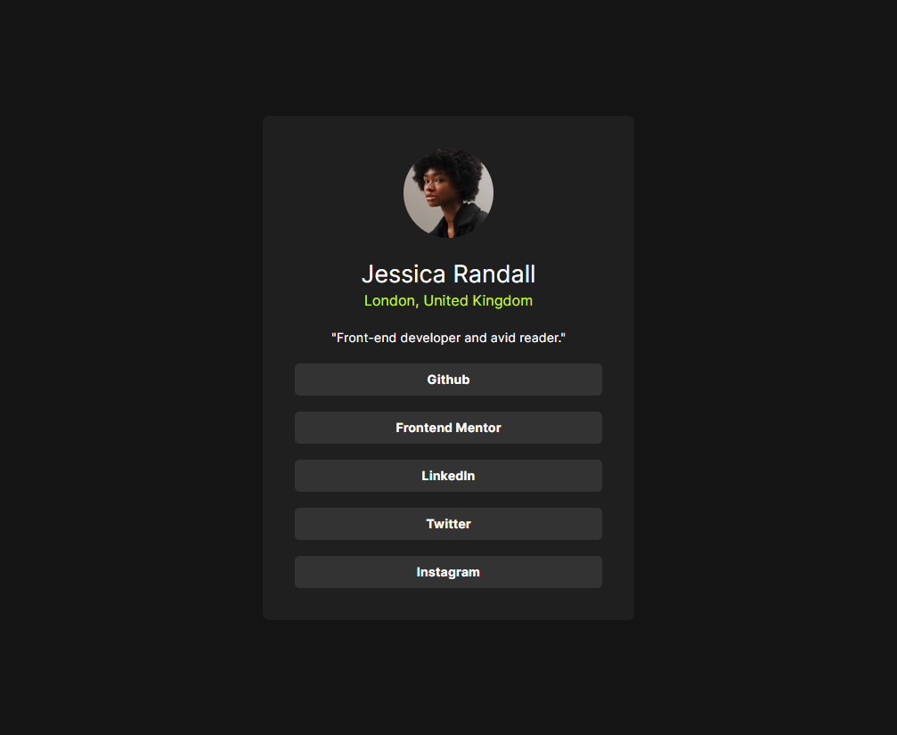

# Frontend Mentor - Social links profile solution

This is a solution to the [Social links profile challenge on Frontend Mentor](https://www.frontendmentor.io/challenges/social-links-profile-UG32l9m6dQ).

## Table of contents

- [Overview](#overview)
  - [Screenshot](#screenshot)
- [My process](#my-process)
  - [Built with](#built-with)
  - [Continued development](#continued-development)
- [Author](#author)

## Overview

### Screenshot

## My process

### Built with

- Semantic HTML5 markup
- CSS custom properties
- Flexbox
- [Tailwind](https://tailwindcss.com/) - Tailwind

### Continued development

I've never been good with CSS so I'm going to keep doing projects, starting with the simplest ones until I learn how to create any design on the frontend.

## Author

- Website - [Felipe Marques](https://www.linkedin.com/in/felipemarquessouza/)
- Frontend Mentor - [@marquesfelip](https://www.frontendmentor.io/profile/marquesfelip)
